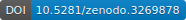

# CitSciScribe

CitSciScribe is a web application written in ASP MVC. The primary function is to allow citizen scientists transcribe handwritten data into a digital format. The transcribed data is made available online with two primary purposes. First, researchers who wish to make use of a collection can access the information. Second, the public gains access to the data and the wealth of knowledge such collections contain.

<strong>Technology Stack</strong> 
* ASP.NET MVC
* MSSQL
* jQuery
* Bootstrap 3.7
* Font Awesome 4

<strong>Organization:</strong> North Carolina Museum of Natural Sciences 
<strong>Project Funding:</strong> NSF Grant Award 1458082 
<strong>Grant Title:</strong> CSBR: Natural History: Curation and Digitization of Significant, Newly Acquired Fish, Amphibian, and Reptile Collections at the North Carolina State Museum of Natural Sciences 
<strong>Grant Investigator(s): </strong> 
Gabriela Hogue <a href="mailto:gabriela.hogue@naturalsciences.org">gabriela.hogue@naturalsciences.org</a> (Principal Investigator) 
Jeffrey Beane (Co-Principal Investigator) 
Christine Goforth (Co-Principal Investigator) 
Bryan Stuart (Co-Principal Investigator) 
Ben Norton (Co-Principal Investigator)

Application Retirement Date: May 5th, 2019 

<strong>Project Contacts</strong> 
Gabriela Hogue 
Collections Manager, Ichthyology 
North Carolina Museum of Natural Sciences 
<a href="mailto:gabriela.hogue@naturealsciences.org">gabriela.hogue@naturealsciences.org</a> 

Chris Goforth 
Head, Citizen Science 
North Carolina Museum of Natural Sciences 
<a href="mailto:chris.goforth@naturalsciences.org">chris.goforth@naturalsciences.org</a> 
 

<strong>Technical Contact</strong> 
Ben Norton 
Head of Technology 
North Carolina Museum of Natural Sciences 
<a href="mailto:ben.norton@naturalsciences.org">ben.norton@naturalsciences.org</a> 

Grant Abstract 
Natural history specimen collections play an essential role in science, from facilitating the discovery of new species to understanding how human activities impact global biodiversity. The specimens in these collections are associated with data of interest to researchers, resource managers, educators, and the general public, such as when and where each specimen was found. Most specimens are irreplaceable because they represent a population or species at a time and place in the past. The North Carolina State Museum of Natural Sciences (NCSM) recently acquired three significant natural history collections of fishes, amphibians, and reptiles that date back to the early 1800's. The NCSM will assimilate these collections to ensure their long-term preservation, and will curate, catalog, verify species identifications, and digitize the specimens to improve their research value and accessibility. Through a custom-built web app, members of the public (citizen scientists) will participate in entering data into the collection database at NCSM, which helps develop public awareness and appreciation for the value and importance of natural history collections.

The three-year project will incorporate the newly acquired collections from the Charleston Museum, Appalachian State University, and the S.W. Ross deep-sea expeditions (University of North Carolina - Wilmington) into the holdings of the North Carolina State Museum of Natural Sciences (NCSM). Due to the precarious curatorial status and lack of accessible associated data for these three collections, there is an urgent need to secure their future and provide for their full utility. Over 57,000 lots will be curated and digitized, making them research ready and web accessible. Citizen scientists will be recruited to use a web application with validation mechanisms that provide the transcriber with real time feedback. This accelerates the goal of incorporating specimen data into the NCSM collection databases and making the collections globally accessible. All data resulting from this project will be shared with iDigBio (https://www.idigbio.org/), ensuring accessibility to researchers and educators. Additional information about the NCSM Fishes, and Amphibian and Reptiles databases is available at http://collections.naturalsciences.org. 
